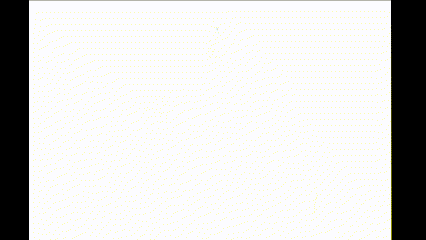

# IndoorUBC-Radar
This is a indoor radar dataset. Researchers and practitioners can utilize this dataset for various applications, including but not limited to indoor mapping, localization, object detection, and activity recognition using radar sensing technology.

## SLAM

## Object Detection

## Dataset Usage Instruction

### Data Description
Each entry in the dataset includes radar scans capturing the layout and structure of indoor spaces such as hallways and rooms.
### Data Format
The dataset is provided in a structured format, with each data entry representing radar scans of various indoor environments within the UBC campus.
### Download
### Generate ImageSet
run 
python gen_imgset.py --total_frames 5000 --train 0.6 --val 0.2 --test 0.2 --output home/downloads
## Signal Preprocessing Tools

### Point Cloud Map

### Objection Detection

## Calibration
### Intrinsic Calibration

### Extrinsic Calibration

## Citation
If you use this dataset in your research or applications, please cite it appropriately to acknowledge the source and contribute to the academic community.

## Terms of Use
Please review the terms of use or licensing information provided with the dataset to understand any restrictions on its usage and distribution.

## Acknowledgments
